# Задача "Исследование JVM через VisualVM"

## Лог выполнения [программы](https://github.com/Arsennikum/jvm-visualvm-experience)
```
04:56:08.831756: loading io.vertx
04:56:09.089802: loaded 529 classes
04:56:12.092207: loading io.netty
04:56:12.543728: loaded 2117 classes
04:56:15.546917: loading org.springframework
04:56:15.714850: loaded 869 classes
04:56:18.715830: now see heap
04:56:18.716368: creating 5000000 objects
04:56:19.048773: created
04:56:22.053007: creating 5000000 objects
04:56:22.245851: created
04:56:25.342802: creating 5000000 objects
04:56:25.534363: created

Process finished with exit code 0
```

## Сопоставление лога с показателями графиков мониторинга через VisualVM

---
### 04:56:09 

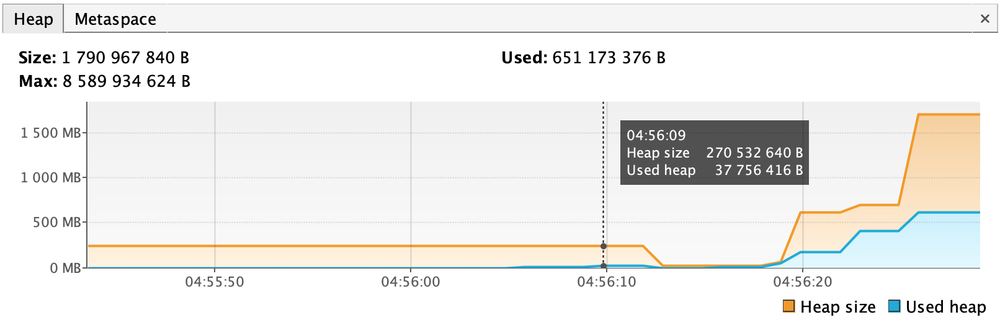 
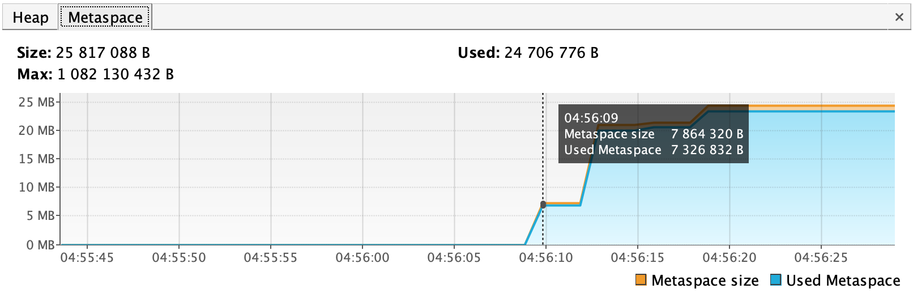 
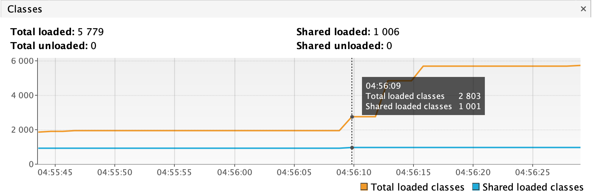 

Загрузка io.vertx: загружено 529 классов. Metaspace для для их хранения был увеличен.

---
### 04:56:12 

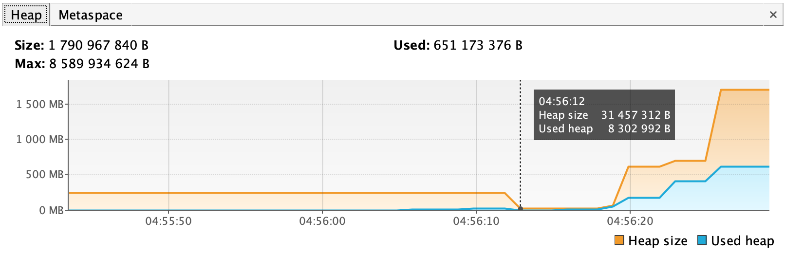 
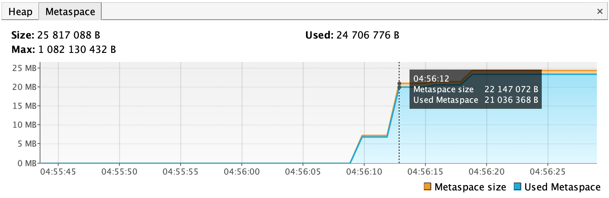 
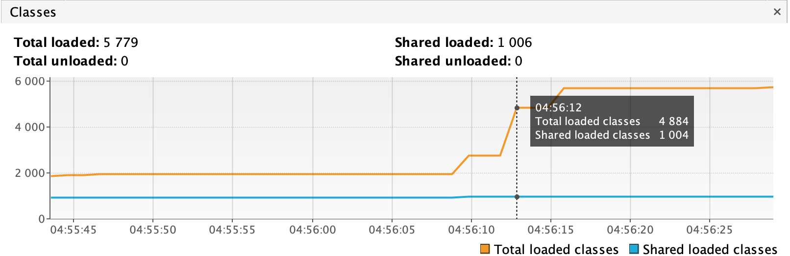 

Загрузка io.netty: загружено 2117 классов. Metaspace снова вырос. Heap уменьшился из-за Garbage Collector.

---
### 04:56:15 - 18

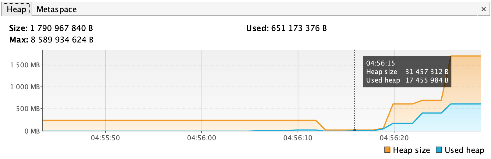 
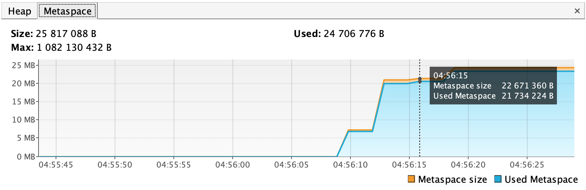 
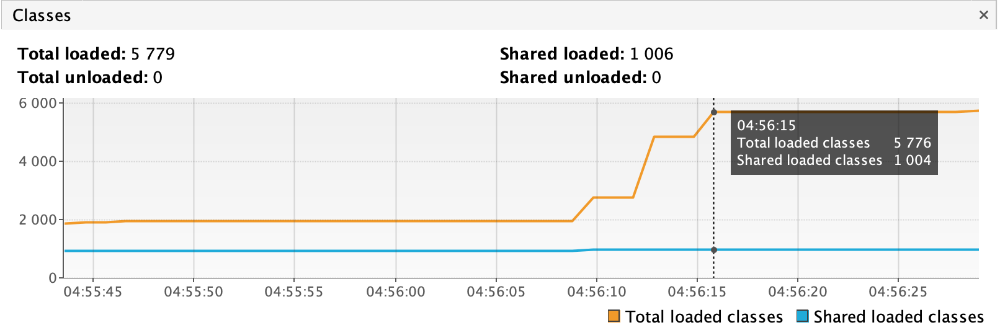 

 
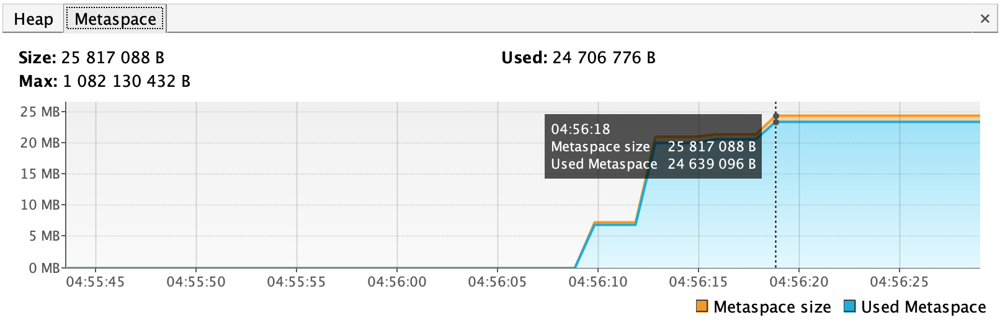 
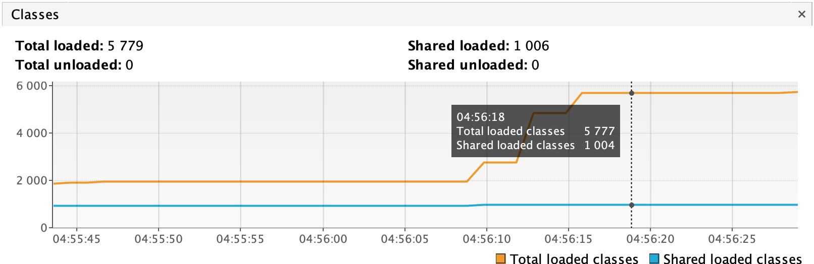 

Загрузка org.springframework. Увеличение Metaspace. Сильное увеличение Heap з-за множества экземпляров классов.

---
### 04:56:19 

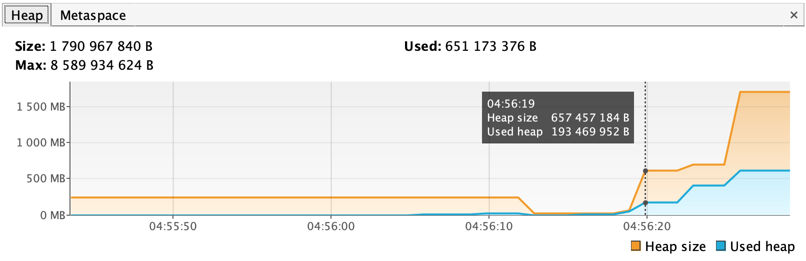 
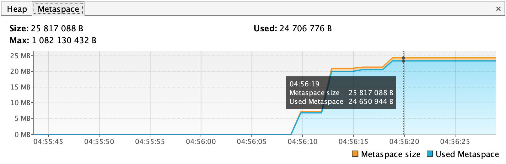 
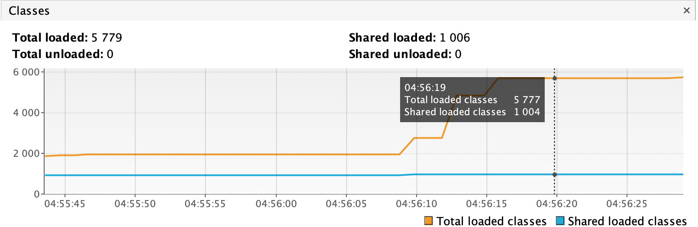 

Создание 5000000 объектов: количество загруженных классов изменилось незначительно. Как и Metaspace. Из-за множества созданных объектов Heap сильно увеличился.

---
### 04:56:22

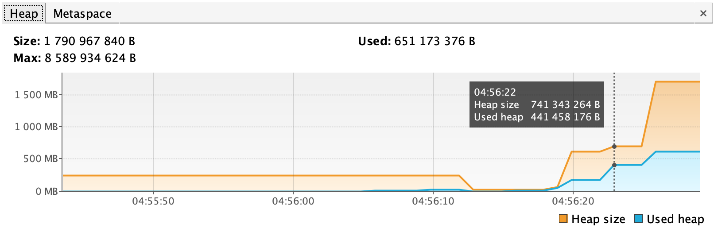 
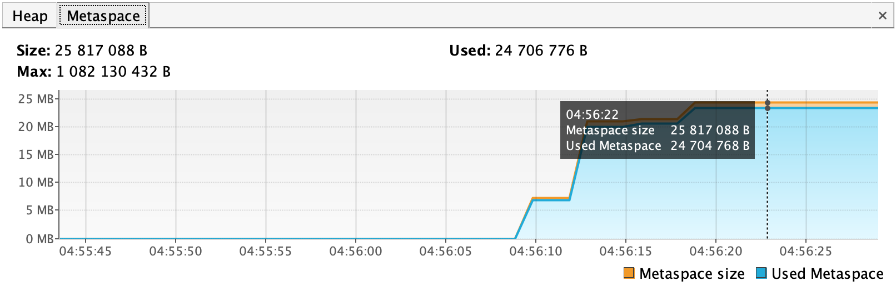 
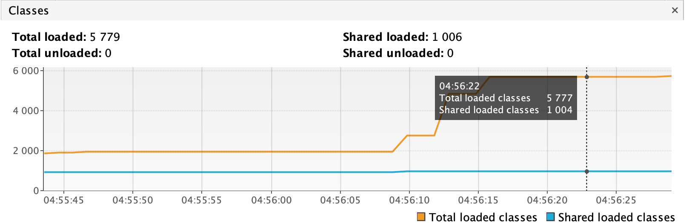 

Создание 5000000 объектов во второй раз: снова загрузился 1 класс. Metaspace немного увеличился. Heap вырос.

---
### 04:56:25

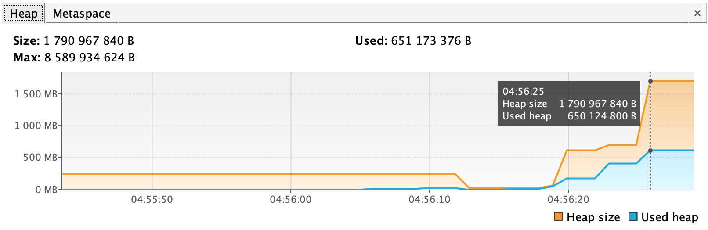 
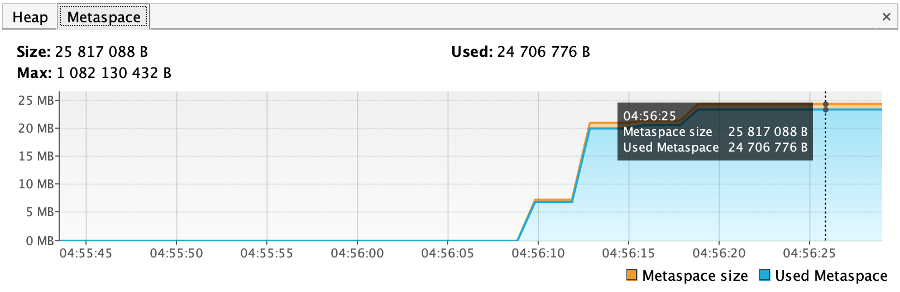 
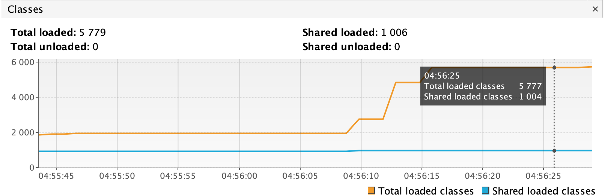 

Создание 5000000 объектов в третий раз, как и в первые 2 загрузился 1 класс. Metaspace стал больше. Heap соотвественно вырос.
